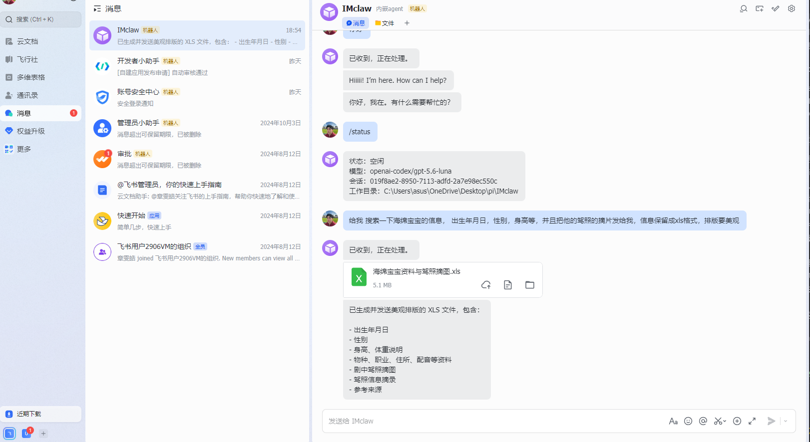
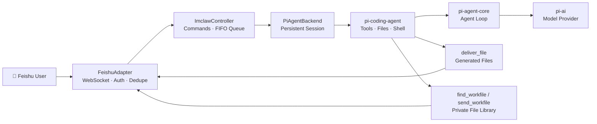

# 🦞 IMclaw

> 一个运行在本地、通过飞书控制的私人 Coding Agent。
> A private, locally hosted coding agent controlled through Feishu.

<p align="center">
  
  
  
  
  
</p>

IMclaw 基于 [pi-mono](https://github.com/badlogic/pi-mono) 构建，在不修改 `pi-ai`、`pi-agent-core` 和 `pi-coding-agent` 核心逻辑的前提下，增加飞书适配、持久化会话、文件回传、私人文件库、任务守卫和 PM2 托管。

IMclaw is built on [pi-mono](https://github.com/badlogic/pi-mono). It keeps the core `pi-ai`, `pi-agent-core`, and `pi-coding-agent` packages intact while adding Feishu integration, persistent sessions, file delivery, a private file library, task guardrails, and PM2 hosting.

## 📸 Demo

<p align="center">
  
</p>

在飞书中发送自然语言任务，IMclaw 会在本机完成资料检索、文件生成和结果回传。上图展示了通过飞书生成并接收 XLS 文件的完整流程。

Send a natural-language task in Feishu and IMclaw performs research, file generation, and delivery on the local machine. The screenshot above shows an XLS file being generated and returned directly in chat.

## ✨ 核心功能 / Features

- 💬 **飞书私聊控制 / Feishu private chat**
  通过长连接实时接收文本消息，只允许指定的主人账号使用。
  Receives text messages through a persistent connection and only accepts the configured owner account.

- 🧠 **完整 Coding Agent / Full coding agent**
  复用 Pi 的模型、工具调用、文件编辑、Shell 和会话能力。
  Reuses Pi's model runtime, tool calling, file editing, shell, and session capabilities.

- 💾 **持久化会话 / Persistent sessions**
  每个飞书聊天拥有独立会话，程序重启后可以继续最近的上下文。
  Each Feishu chat has an independent session that can continue after a restart.

- 📤 **文件生成与回传 / Generated file delivery**
  Agent 生成 PDF、Word、Excel、PPT、视频或普通文件后，可直接发送到当前飞书聊天。
  Generated PDFs, Word documents, spreadsheets, presentations, videos, and other files can be delivered directly to the active chat.

- 📁 **私人 `workfile` 文件库 / Private `workfile` library**
  使用自然语言递归检索已有文件；唯一强匹配直接发送，存在歧义时先让用户确认。原文件永不删除。
  Recursively searches existing files using natural language. Clear matches are sent immediately; ambiguous matches require confirmation. Originals are never deleted.

- 🌐 **联网研究 / Web research**
  Agent 可以在隔离的后台浏览器中查找资料、下载资源并制作交付文件。
  The agent can research, download resources, and prepare deliverables in an isolated headless browser.

- 🛡️ **任务守卫 / Task guardrails**
  单次任务限制为 10 分钟、20 次工具调用和 2 次后台浏览器启动，并在结束后清理临时资源。
  Each task is limited to 10 minutes, 20 tool calls, and two headless browser launches, followed by temporary-resource cleanup.

- ♻️ **PM2 后台运行 / PM2 hosting**
  关闭终端后继续运行，异常退出时自动重启，并支持保存、恢复进程列表。
  Keeps running after the terminal closes, automatically restarts after crashes, and supports saved process restoration.

## 🏗️ 架构 / Architecture



### 消息流程 / Message flow

```text
Feishu message
  → owner verification and deduplication
  → per-chat FIFO queue
  → persistent Pi AgentSession
  → model reasoning and tool execution
  → text or file response
  → Feishu chat
```

## 🧰 技术栈 / Tech Stack

| Component | Purpose |
| --- | --- |
| TypeScript + Node.js | IMclaw application runtime |
| `pi-ai` | Model providers, streaming, authentication |
| `pi-agent-core` | Agent loop and tool execution |
| `pi-coding-agent` | Sessions, file tools, shell, persistence |
| Feishu Node SDK | Long connection, messages, file upload |
| PM2 | Background process management and recovery |
| Vitest | Unit and integration testing |

## 🚀 快速开始 / Quick Start

### 1. 环境要求 / Requirements

- Node.js `>= 22.19.0`
- 一个飞书企业自建应用，并启用机器人能力
- 可用的 Pi 模型认证
- Windows、macOS 或 Linux；当前 PM2 指南以 Windows 为例

### 2. 安装与构建 / Install and build

```powershell
git clone git@github.com:WenhaoZhang0223/IMclaw.git
cd IMclaw

npm install --ignore-scripts
npm run build
```

### 3. 配置环境变量 / Configure environment

```powershell
$env:FEISHU_APP_ID = "cli_xxx"
$env:FEISHU_APP_SECRET = "your-app-secret"
$env:IMCLAW_OWNER_OPEN_ID = "ou_xxx"
$env:IMCLAW_WORKSPACE = "C:\path\to\IMclaw"
```

可选配置 / Optional:

```powershell
$env:IMCLAW_PROVIDER = "openai-codex"
$env:IMCLAW_MODEL = "gpt-5.6-luna"
$env:IMCLAW_AGENT_DIR = "$env:USERPROFILE\.pi\agent"
```

> 不要把真实密钥写进代码、README 或 Git。
> Never commit real credentials to source control.

### 4. 启动 / Start

```powershell
npx pm2 start ecosystem.config.cjs
npx pm2 save
npx pm2 status
```

关闭终端后 IMclaw 仍会继续运行。电脑重启后可以恢复已保存的进程：

IMclaw keeps running after the terminal closes. Restore the saved process list after a reboot:

```powershell
cd C:\path\to\IMclaw
npx pm2 resurrect
```

查看日志 / View logs:

```powershell
npx pm2 logs IMclaw
```

## 🤖 飞书应用配置 / Feishu App Setup

1. 在飞书开放平台创建“企业自建应用”。
   Create an enterprise custom app in Feishu Open Platform.
2. 启用机器人能力。
   Enable the bot capability.
3. 开通以下权限：
   Enable these permissions:
   - `im:message.p2p_msg:readonly`
   - `im:message:send_as_bot`
4. 在“事件与回调”中选择长连接，并订阅：
   Select persistent connection under Events & Callbacks and subscribe to:
   - `im.message.receive_v1`
5. 发布应用，并将自己加入可用范围。
   Publish the app and include your own account in its availability scope.

详细配置见 [IMclaw 本机运行指南](packages/imclaw/README.md)。

See the [local setup guide](packages/imclaw/README.md) for detailed configuration.

## 📁 文件处理 / File Workflows

### `deliver_file`

用于 Agent 新生成的最终交付文件。文件成功发送到飞书后，本地交付副本会被删除；上传或消息发送失败时保留文件，便于重试。

Used for newly generated deliverables. After successful delivery, the local delivery copy is deleted. Failed uploads or sends preserve the file for retry.

### `find_workfile` + `send_workfile`

`workfile/` 是用户自行维护的只读长期文件库：

`workfile/` is a user-maintained, read-only long-term file library:

- 支持递归子目录和自然语言元数据检索。
- 根据文件名、相对目录、扩展名和修改时间匹配。
- 不读取文件正文。
- 发送成功或失败都不会修改、移动或删除原文件。
- `workfile/` 已加入 `.gitignore`，私人文件不会进入仓库。

---

- Supports recursive directories and natural-language metadata search.
- Matches names, relative directories, extensions, and modification times.
- Never reads file contents for indexing.
- Never modifies, moves, or deletes originals.
- `workfile/` is ignored by Git so private files stay local.

## 🛡️ 安全设计 / Security

- 只处理指定主人 Open ID 发来的私聊消息。
- Agent 无法为文件发送指定其他聊天目标。
- 文件工具执行真实路径检查，拒绝 `..` 和符号链接越界。
- 浏览器必须使用后台无界面模式和工作区内的临时配置目录。
- 任务结束时只清理 IMclaw 保留名称的临时资源。
- 不在日志中记录文件内容、App Secret 或模型凭证。

---

- Accepts private messages only from the configured owner Open ID.
- File tools cannot redirect delivery to another chat.
- Real-path validation blocks traversal and symbolic-link escape.
- Browser automation must be headless and use an isolated workspace profile.
- Cleanup only targets IMclaw-reserved temporary resources.
- File contents, app secrets, and model credentials are never logged intentionally.

> ⚠️ Pi 和 IMclaw 默认继承启动进程所属用户的本机权限。生产或多人环境应额外使用容器或系统级沙箱。
> Pi and IMclaw inherit the permissions of the operating-system user that starts the process. Use a container or system sandbox for production or multi-user environments.

## ⌨️ 飞书命令 / Commands

| Command | 中文 | English |
| --- | --- | --- |
| `/help` | 查看命令帮助 | Show command help |
| `/new` | 创建新会话 | Start a new session |
| `/status` | 查看模型和会话状态 | Show model and session status |
| `/abort` | 中止任务并清空等待队列 | Abort the task and clear its queue |

## 🗂️ 项目结构 / Project Structure

```text
packages/
├── ai/             # Model providers and streaming
├── agent/          # Core agent loop
├── coding-agent/   # Sessions, tools, persistence
└── imclaw/         # Feishu integration and PM2-hosted agent
    ├── src/
    │   ├── feishu-adapter.ts
    │   ├── controller.ts
    │   ├── pi-backend.ts
    │   ├── deliver-file.ts
    │   ├── find-workfile.ts
    │   ├── send-workfile.ts
    │   └── task-guard.ts
    └── test/
```

更多架构说明见 [PI_MONO_ARCHITECTURE.md](docs/PI_MONO_ARCHITECTURE.md)。

For more architecture details, see [PI_MONO_ARCHITECTURE.md](docs/PI_MONO_ARCHITECTURE.md).

## ✅ 验证 / Validation

```powershell
# IMclaw tests
cd packages/imclaw
node ../../node_modules/vitest/dist/cli.js --run

# Repository formatting and type checks
cd ../..
npm run check
```

## 🙏 致谢 / Acknowledgements

IMclaw 是基于 [badlogic/pi-mono](https://github.com/badlogic/pi-mono) 构建的个人项目。感谢 Pi 项目提供优秀的模型抽象、Agent 运行时和 Coding Agent 基础设施。

IMclaw is a personal project built on [badlogic/pi-mono](https://github.com/badlogic/pi-mono). Thanks to the Pi project for its model abstractions, agent runtime, and coding-agent infrastructure.

## 📄 License

[MIT](LICENSE)
