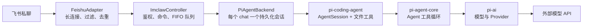
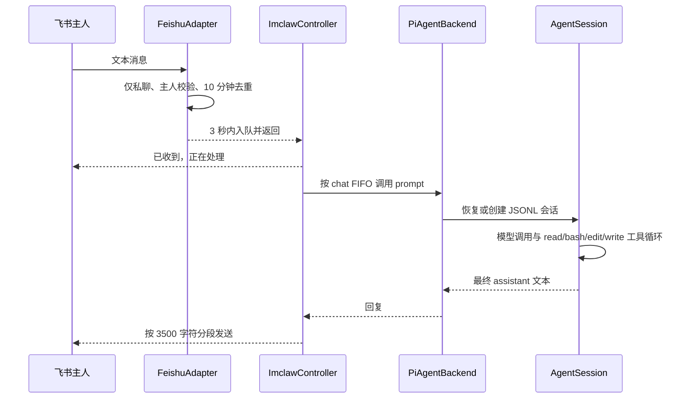

# pi-mono 核心架构与 IMclaw 接入点

IMclaw 基于 pi-mono，核心包保持原样：

- `packages/ai`：统一模型、鉴权、消息和流式响应。
- `packages/agent`：执行模型调用、工具调用和结果回填循环。
- `packages/coding-agent`：提供文件工具、`AgentSession`、JSONL 会话持久化和 SDK。
- `packages/imclaw`：IMclaw 新增的飞书适配、消息队列和 PM2 入口。

IMclaw 不修改三个核心包。上游更新时可从 `upstream` 拉取；冲突主要局限于根配置和新增 package。Agent 以启动 PM2 的 Windows 用户权限运行，因此应把 `IMCLAW_WORKSPACE` 指向专用目录，并保护飞书密钥和 pi 的鉴权文件。
